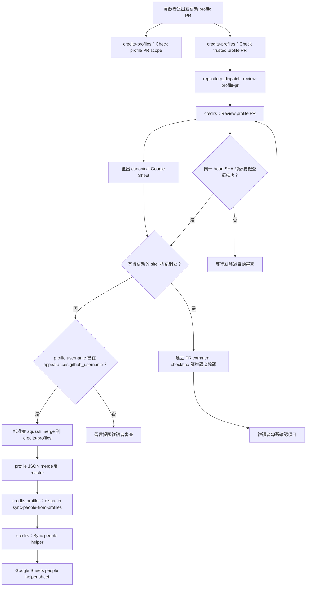
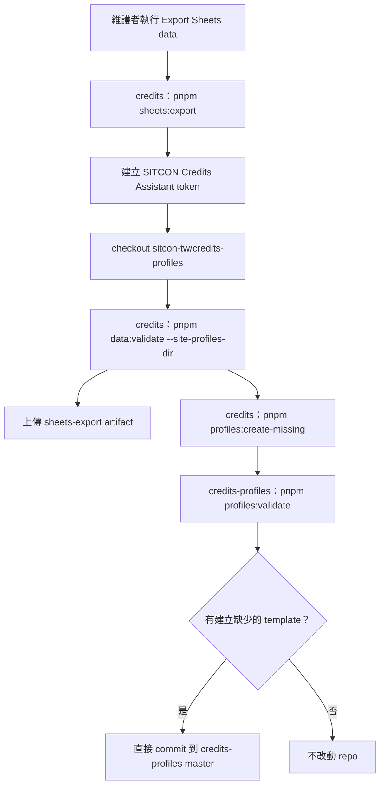
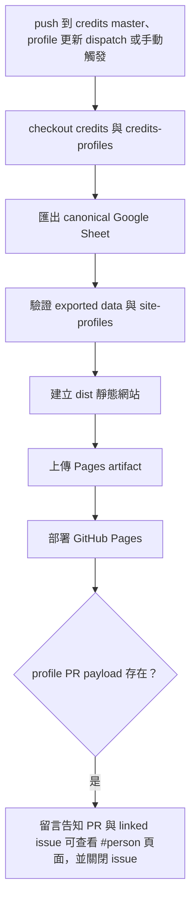
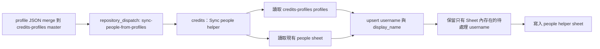

# 自動化流程

這份文件給維護者、對專案自動化有興趣的貢獻者，以及需要理解兩個 repo 如何互相觸發的人閱讀。`credits` 負責 canonical Google Sheets 與需要 secrets 的動作；`credits-profiles` 負責 profile PR 的低風險自助檢查。

repo 內已有完整 workflow 定義，`credits` 的 GitHub Pages 也使用 GitHub Actions 部署。需要 credentials、跨 repo 寫入、留言、核准或合併的流程，仍取決於 repository secrets、variables、Google Workspace 權限、`SITCON Credits Assistant` GitHub App 安裝與 branch ruleset 配合。

## 自助 profile PR

重點：

- `Profile self-service guard` 在 `pull_request_target` 上檢查 self-service PR 是否只修改 PR 作者自己的單一 `profiles/<github_username>.json`。
- `Trusted profile review` 只使用 base repository 的可信任程式碼，透過 GitHub API 讀取 PR head 的單一 profile JSON，檢查格式與 PR template 必要確認事項。
- `Trusted profile review` 通過後 dispatch 到 `sitcon-tw/credits`，由 `Review profile PR` 在主 repo 的 secrets 之下匯出 canonical Google Sheet。
- `Review profile PR` 會確認同一個 head SHA 的 `Check trusted profile PR` 與 `Check profile PR scope` 都成功，再檢查 PR 或 linked issue 內是否有仍待套用的 `site:` 標記網址。
- 若標記網址可精準對到 canonical Sheet 中仍使用 `site:<source_person_id>` 的 rows，workflow 會在 PR 上建立維護者確認 comment，列出將改成該 GitHub username 的 canonical rows；這會先阻擋自動合併，即使該 username 已經出現在其他 `appearances.github_username`。
- 維護者勾選該 comment 內的確認 checkbox 後，`credits-profiles` 會確認勾選者有 repository write、maintain 或 admin 權限，再 dispatch 到 `credits` 寫入 canonical Google Sheet。若 GitHub comment event 沒有觸發，可用 `Apply profile claims` workflow_dispatch fallback 輸入 PR number 與 head SHA。
- 沒有待套用標記網址時，workflow 才會以 profile username 是否已經以裸 GitHub username 形式存在於 `appearances.github_username` 判斷是否可自動核准並 squash merge。
- 標記與 canonical Sheet 不一致、或 Sheet 中有多筆可疑匹配時，workflow 只會留言提醒維護者人工審查。

自動核准與合併只代表 profile PR 符合低風險自助更新條件，而且 username 已經被 canonical data 以裸值參照。它不代表 workflow 建立了新的身份合併，也不代表它處理了歷史資料更正、刪除 profile、rename profile 或隱私政策例外。`site:<source_person_id>` 不會讓 profile PR 自動通過。

## Sheets 匯出與空白 profile template

`Export Sheets data` 是手動觸發、需要憑證的 workflow。它會匯出 canonical Sheet、checkout `credits-profiles`、驗證本機資料與 `site:` references、上傳 artifact，並檢查 `people.github_username` 中是否有 `credits-profiles` 尚不存在的 profile 檔案。

若缺少 profile 檔案，workflow 會建立空白 template，驗證 profile 格式，然後由 `SITCON Credits Assistant` GitHub App 直接 commit 到 `credits-profiles` 的 `master`。這不會開 PR，也不會填入簡介、頭像、連結、別名、身份證據或歷史 appearance 連結。`site:` profile reference 不會產生空白 profile template。

## 活動網站來源 profile

`appearances.github_username` 可以填 `site:<source_person_id>`，表示這筆 appearance 暫時連到同一列 `event_id` 對應的 `credits-profiles/site-profiles/<event_id>/<source_person_id>.json`。site profile 只提供活動網站來源的顯示名稱與頭像，不是 contributor-owned profile，也不代表身份合併。

`site-profiles/` 只由維護者直接 commit，不接受一般 Pull Request 修改，不觸發 `people` helper 同步，也不會被 profile PR auto-review 當成 username。`data:validate` 在有 site profile checkout 時會檢查 Sheet 中的 `site:` reference 是否存在，並驗證 site profile 只含 `display_name` 與 `avatar_url`。

## GitHub Pages 部署

`Deploy GitHub Pages` 會在 push 到 `master`、收到 `credits-profiles` 的 `rebuild-pages-from-profiles` dispatch，或手動觸發時執行。它需要 `GOOGLE_SERVICE_ACCOUNT_JSON` repository secret 讀取 canonical Sheet，並從 `credits-profiles` 讀取 contributor profile 與 `site-profiles` 顯示資料。workflow 會產生 `dist/`、上傳 Pages artifact，並交給 GitHub Pages 部署；repository 的 Pages build type 是 GitHub Actions。

若 deploy 是由 `credits-profiles` profile PR merge 後的 rebuild dispatch 觸發，而且 dispatch payload 可辨識單一 `profiles/<github_username>.json` PR，部署成功後 workflow 會回到該 PR 留言；若 PR body linked 到 profile request issue，也會先回到原 issue 留言，提供 `https://sitcon.org/credits/#person=<github_username>` 讓貢獻者查看公開呈現，再關閉原 issue。

Pages 網頁預設只提供公開索引查詢。貢獻者需要請維護者確認哪些項目可能是在記錄自己時，可以打開 [標記我的貢獻紀錄](https://sitcon.org/credits/?claim=1)；頁面會把選取結果保存在網址中，讓貢獻者直接分享該頁網址。這個 handoff 不會寫入 Google Sheets，也不會讓 profile PR 自動完成身份合併；維護者仍需在 canonical Sheet 中人工確認後，才可調整 `appearances.github_username`。

Pages 前端是公開索引與標記流程的原型凍結版，會繼續透過 GitHub Actions 部署公開輸出。部署失敗、資料安全或隱私風險、公開資料明顯錯誤、既有必要流程無法使用時，仍可依問題性質另外處理；其他前端新功能、介面微調、體驗修補或重新設計期待，請集中到 [Pages 前端重新設計需求盤點](https://github.com/sitcon-tw/credits/issues/2)，作為後續訪談、設計討論與規劃輸入。

## people helper 同步

`people` 是 helper sheet，不是 canonical profile source，也不是允許清單。同步 profile repo 到 `people` 只是在 Google Sheets 中提供選取提示與維護提醒；它不會新增、修改或核准任何 `appearances.github_username`。`site:` profile reference 不會同步到 `people`。

## Branch Ruleset 建議

`credits-profiles` 的 profile self-service 分支保護或 ruleset 應要求：

- `Check trusted profile PR`
- `Check profile PR scope`
- 專案預期的 profile review policy

不要要求一般 `CI` 作為 profile PR 必要檢查，因為一般 `pull_request` CI 刻意不在 fork PR 上啟用，以避免 workflow approval 讓自助 profile PR 卡住。支援檔案、docs、schema、workflow、刪除、rename 或修改他人 profile 的 PR，應由維護者人工 review 並加上 `profile-scope-reviewed` label。
